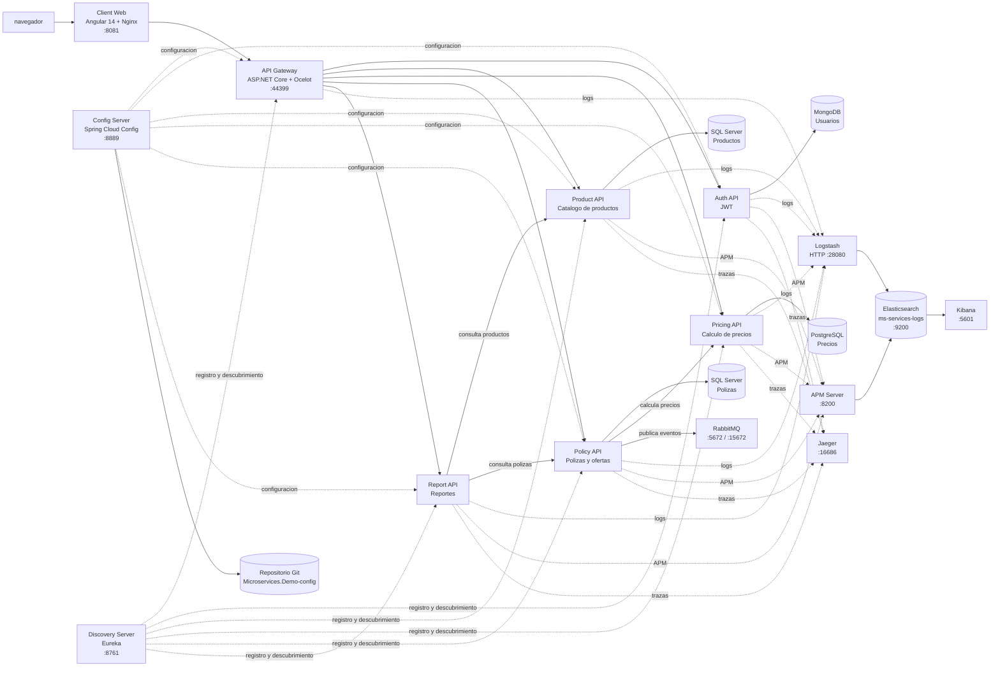
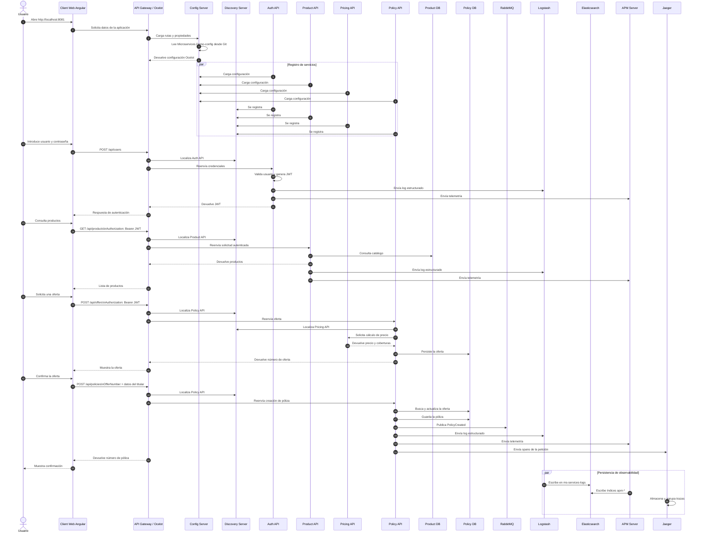

# Diagrama de componentes

Este documento describe cómo se conectan los componentes de `Microservices.Demo`. Todos los contenedores de Compose comparten la red Docker `backend`; por eso pueden comunicarse usando sus nombres de servicio como DNS interno.

## Vista general

## Diagrama de secuencia: flujo completo

El siguiente flujo muestra una sesión típica desde que el navegador carga la aplicación hasta la creación de una póliza. Las llamadas de configuración, descubrimiento y observabilidad ocurren alrededor de las llamadas de negocio.

## Responsabilidades

| Componente       | Responsabilidad                                                  |                       Puerto local |
| ---------------- | ---------------------------------------------------------------- | ---------------------------------: |
| Client Web       | Interfaz Angular para autenticación y operaciones de negocio.    |                             `8081` |
| API Gateway      | Entrada HTTP pública, rutas Ocelot, JWT y descubrimiento Eureka. |                            `44399` |
| Auth API         | Valida usuarios y emite tokens JWT.                              |                       interno `80` |
| Product API      | Administra el catálogo y el estado de los productos.             |                       interno `80` |
| Pricing API      | Calcula precios y persiste tarifas con Marten.                   |                       interno `80` |
| Policy API       | Crea, consulta y termina pólizas; usa Pricing y RabbitMQ.        |                       interno `80` |
| Report API       | Compone reportes consultando Product y Policy.                   |                       interno `80` |
| Config Server    | Distribuye configuración centralizada desde Git.                 |                             `8889` |
| Discovery Server | Registra servicios y localiza instancias mediante Eureka.        |                             `8761` |
| Bases de datos   | Persistencia aislada por bounded context.                        | `27018`, `14331`, `14332`, `54321` |
| RabbitMQ         | Mensajería de eventos de Policy API.                             |                    `5672`, `15672` |
| Logstash         | Recibe y transforma logs HTTP.                                   |                            `28080` |
| Elasticsearch    | Indexa logs en `ms-services-logs` y datos APM.                   |                             `9200` |
| Kibana           | Consulta logs y crea visualizaciones.                            |                             `5601` |
| APM Server       | Recibe telemetría de rendimiento y errores.                      |                             `8200` |
| Jaeger           | Visualiza trazas distribuidas.                                   |                            `16686` |

## Flujos principales

### Autenticación

1. El cliente envía credenciales a `POST /api/users` mediante el Gateway.
2. Auth API consulta MongoDB.
3. Auth API devuelve un JWT.
4. El cliente usa `Authorization: Bearer <token>` en las operaciones protegidas.

### Creación de una póliza

1. El cliente envía `POST /api/policies` mediante el Gateway.
2. Policy API consulta la oferta en SQL Server.
3. Policy API puede consultar Pricing API mediante Eureka.
4. Policy API persiste la póliza.
5. Policy API publica eventos en RabbitMQ.

### Observabilidad

1. Los servicios envían logs estructurados a Logstash por HTTP.
2. Logstash escribe los documentos en Elasticsearch, índice `ms-services-logs`.
3. En Kibana, la Data View recomendada es exactamente `ms-services-logs` con `@timestamp`.
4. APM Server almacena telemetría en índices `apm-*` y Jaeger muestra las trazas distribuidas.

## Compose

- `docker-compose-infr.yml`: Config Server, Discovery Server, Gateway, Auth, RabbitMQ y observabilidad.
- `docker-compose-db.yml`: MongoDB, SQL Server y PostgreSQL.
- `docker-compose-app.yml`: APIs de dominio y cliente Angular.
- `docker-compose-all.yml`: infraestructura, APIs y cliente, sin bases de datos.
