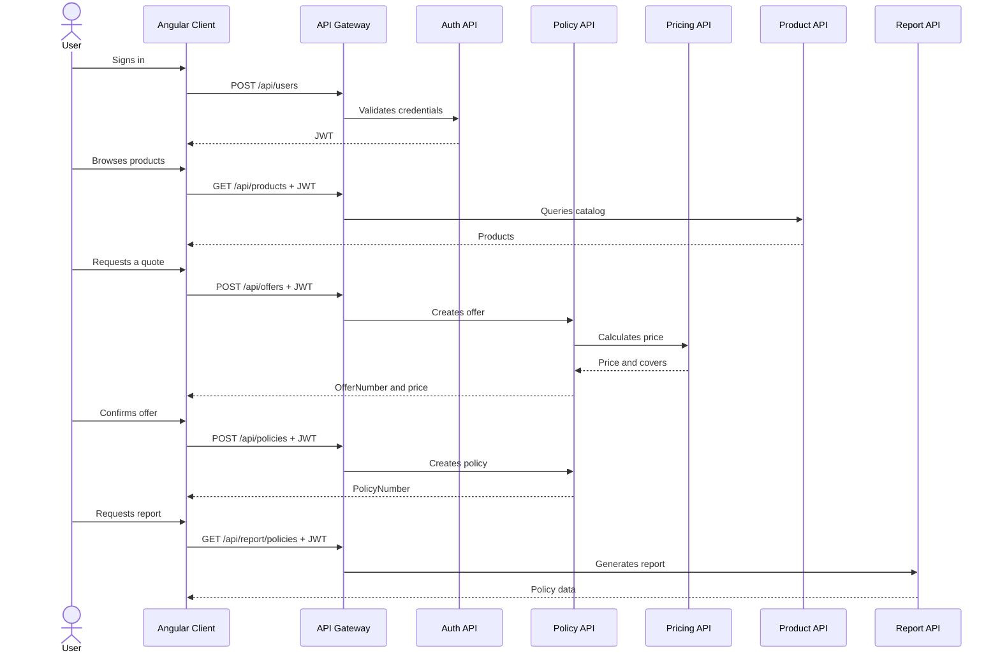

# Microservices.Demo.Client.Web

Angular 14 web client for the insurance demo. It is the user interface for authentication, product browsing, quote calculation, policy creation, and reports.

The browser does not connect directly to Product API, Policy API, Pricing API, or their databases. All business calls go through the API Gateway at `http://localhost:44399`; the Gateway validates JWTs, applies Ocelot routes, and locates the destination service through Eureka.

## Project contents

- `src/app/login`: sign-in screen.
- `src/app/home`: post-login home screen.
- `src/app/products`: product listing and lookup.
- `src/app/policies`: policy reports and policy creation from an offer.
- `src/app/chat`: demo chat screen.
- `src/app/side-nav`: navigation between protected areas.
- `src/app/services`: HTTP clients that wrap Gateway calls.
- `src/app/interceptors`: interceptor that adds `Authorization: Bearer <token>`.
- `src/app/guard`: guard that blocks protected routes without a valid session.
- `src/app/models`: TypeScript request and response interfaces.

The application uses Angular Material, Reactive Forms, RxJS, and `@auth0/angular-jwt` to check local token expiration.

## Authentication

1. `/login` is public.
2. The user sends credentials through `AuthService` to the Gateway's `POST /api/users`.
3. The Gateway forwards the request to Auth API.
4. Auth API validates the user against MongoDB and returns a JWT.
5. The client stores the response in `sessionStorage` under `currentUser`.
6. `AuthService` checks that the token is not expired.
7. `CanActivateGuard` allows protected routes only when `isAuthenticated` is true.
8. `AuthInterceptor` adds the JWT to subsequent HTTP requests.

The client does not store passwords. The session exists only in browser `sessionStorage` and is lost when the tab is closed or storage is cleared.

## Service interactions

### API Gateway

This is the frontend's only direct HTTP dependency. Angular services build URLs using the current browser host and port `44399`:

```text
http://<browser-host>:44399
```

The Gateway provides a stable client address; Eureka, Config Server, and the API replicas are behind it.

### Auth API and MongoDB

The frontend interacts with Auth API through:

```text
POST /api/users
```

The response contains the JWT and authentication state. MongoDB is transparent to the client; Auth API queries the user collection.

### Product API and SQL Server

`ProductsService` uses:

```text
GET /api/products
GET /api/products/{productCode}
```

Product API queries its SQL Server and returns the catalog. The frontend knows only the product JSON model, not tables, Entity Framework, or connection strings.

### Policy API, Pricing API, and SQL Server

`OffersService` starts the offer flow:

```text
POST /api/offers
```

The request contains `ProductCode`, validity dates, selected covers, and questionnaire answers. Although the client calls `/api/offers`, the Gateway sends it to Policy API; Policy API calls Pricing API to calculate the price and stores the offer in its own database.

When the user confirms the offer, `PoliciesService` sends:

```text
POST /api/policies
```

The request contains `OfferNumber`, `PolicyHolder`, and `PolicyHolderAddress`. Policy API finds the offer, converts it into a policy, stores it in SQL Server, and publishes the corresponding event to RabbitMQ. The frontend receives `PolicyNumber`.

The frontend does not call Pricing API directly. Pricing participates in the offer flow behind Policy API.

### Report API

The policy screen requests the report through:

```text
GET /api/report/policies
```

The client receives data ready for display. Report API composes it by querying Product API and Policy API through Eureka; Angular does not perform that composition.

### Config Server and Discovery Server

The frontend does not call these services. They are internal dependencies of the Gateway and APIs:

- Config Server provides routes, URLs, and connection strings.
- Discovery Server registers instances and locates dynamic APIs.
- The frontend only needs both to be available so the Gateway can route requests.

### RabbitMQ and observability

The frontend also does not connect directly to RabbitMQ, Logstash, Elasticsearch, Kibana, APM Server, or Jaeger. APIs and the Gateway send events to these tools:

```text
Frontend -> Gateway -> API -> Logstash -> Elasticsearch -> Kibana
                         |-> APM Server -> Elasticsearch
                         |-> Jaeger
                         |-> RabbitMQ (Policy events)
```

## Complete operation flow



## Local execution

Requires Node.js 16 and npm. From this directory install dependencies and start the development server:

```powershell
npm ci
npm start
```

The application runs at `http://localhost:4200`. It calls the API Gateway at `http://localhost:44399`, so databases, infrastructure, and APIs must be available. You can start those dependencies with the root Compose files while keeping the client outside Docker.

To build the production bundle without starting a server:

```powershell
npm run build
```

## Docker execution

The image builds Angular and serves the result with Nginx at `http://localhost:8081`:

```powershell
docker-compose -f ..\..\..\docker-compose-app.yml build microservices.demo.client.web
docker-compose -f ..\..\..\docker-compose-app.yml up -d microservices.demo.client.web
```

The Gateway must be available at `http://localhost:44399`, and the databases and APIs must be running. To start the complete environment from the root:

```powershell
docker-compose -f .\docker-compose-infr.yml up -d
docker-compose -f .\docker-compose-db.yml up -d
docker-compose -f .\docker-compose-app.yml up -d
```

## Functional structure

- `src/app/services`: HTTP clients for authentication and business domains.
- `src/app/guards`: route protection based on authentication state.
- `src/assets`: images and static resources.
- `src/environments`: Angular build configuration.

## Useful commands

```powershell
npm start
npm run build
npm test -- --watch=false --browsers=ChromeHeadless
```

If the browser reports network errors, check the Gateway first at `http://localhost:44399` and inspect `docker logs Microservices.Demo.Client.Web.ApiGateway`.
