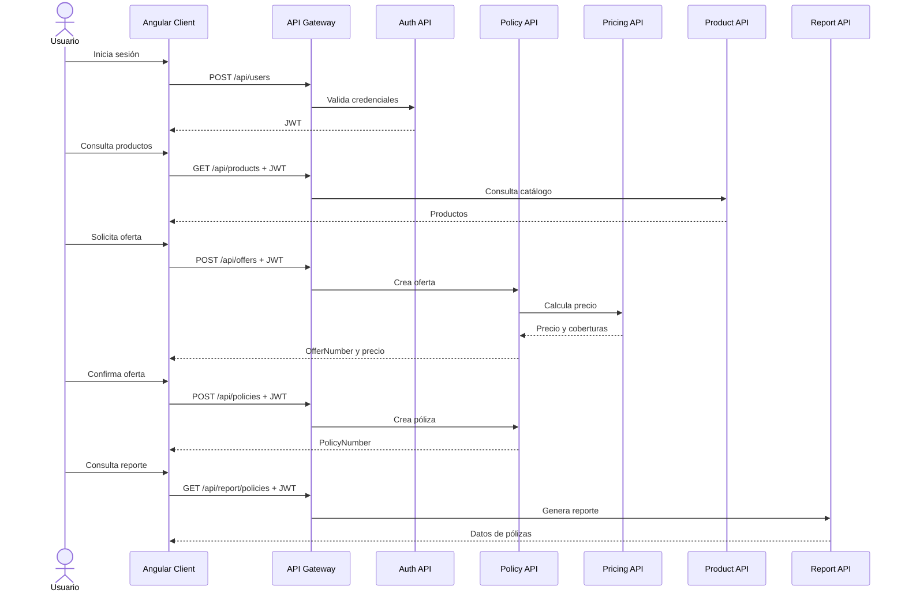

# Microservices.Demo.Client.Web

Cliente web Angular 14 para la demo de seguros. Es la interfaz que utiliza el usuario para autenticarse, consultar productos, calcular ofertas, crear pólizas y consultar reportes.

El navegador no se conecta directamente a Product API, Policy API, Pricing API ni a sus bases de datos. Todas las llamadas de negocio salen hacia el API Gateway en `http://localhost:44399`; el Gateway valida el JWT, aplica las rutas de Ocelot y localiza el microservicio destino mediante Eureka.

## Qué contiene el proyecto

- `src/app/login`: pantalla de inicio de sesión.
- `src/app/home`: pantalla principal después de autenticarse.
- `src/app/products`: listado y consulta de productos.
- `src/app/policies`: listado de reportes de pólizas y creación de una póliza a partir de una oferta.
- `src/app/chat`: pantalla de chat de la demo.
- `src/app/side-nav`: navegación entre las áreas protegidas.
- `src/app/services`: clientes HTTP que encapsulan las llamadas al Gateway.
- `src/app/interceptors`: interceptor que añade `Authorization: Bearer <token>`.
- `src/app/guard`: guard que impide entrar a las rutas protegidas sin una sesión válida.
- `src/app/models`: interfaces TypeScript para requests y responses.

La aplicación utiliza Angular Material, Reactive Forms, RxJS y `@auth0/angular-jwt` para comprobar la expiración local del token.

## Cómo funciona la autenticación

1. La ruta `/login` es pública.
2. El usuario envía sus credenciales mediante `AuthService` a `POST /api/users` del Gateway.
3. El Gateway reenvía la petición a Auth API.
4. Auth API valida el usuario contra MongoDB y devuelve un JWT.
5. El cliente guarda la respuesta en `sessionStorage` bajo `currentUser`.
6. `AuthService` comprueba que el token no esté expirado.
7. `CanActivateGuard` permite las rutas protegidas solo si `isAuthenticated` es verdadero.
8. `AuthInterceptor` añade el JWT a las peticiones HTTP posteriores.

El cliente no guarda contraseñas. La sesión se conserva únicamente en el `sessionStorage` del navegador y se pierde al cerrar la pestaña o limpiar el almacenamiento.

## Interacción con los servicios

### API Gateway

Es la única dependencia HTTP directa del frontend. Los servicios Angular construyen sus URLs usando el host actual del navegador y el puerto `44399`:

```text
http://<host-del-navegador>:44399
```

El Gateway proporciona una dirección estable al cliente; detrás de él se encuentran Eureka, Config Server y las réplicas de las APIs.

### Auth API y MongoDB

El frontend interactúa con Auth API únicamente mediante:

```text
POST /api/users
```

La respuesta contiene el token JWT y el estado de autenticación. MongoDB es transparente para el cliente: Auth API es quien consulta la colección de usuarios.

### Product API y SQL Server

`ProductsService` utiliza:

```text
GET /api/products
GET /api/products/{productCode}
```

Product API consulta su SQL Server y devuelve el catálogo. El frontend solo conoce el modelo JSON de producto; no conoce tablas, Entity Framework ni la cadena de conexión.

### Policy API, Pricing API y SQL Server

El frontend utiliza `OffersService` para iniciar el flujo de una oferta:

```text
POST /api/offers
```

El request contiene `ProductCode`, fechas de vigencia, coberturas seleccionadas y respuestas del cuestionario. Aunque el cliente llama a `/api/offers`, el Gateway entrega la petición a Policy API; Policy API consulta Pricing API para calcular el precio y persiste la oferta en su propia base.

Cuando el usuario confirma la oferta, `PoliciesService` envía:

```text
POST /api/policies
```

El request contiene `OfferNumber`, `PolicyHolder` y `PolicyHolderAddress`. Policy API busca la oferta, la convierte en póliza, la guarda en SQL Server y publica el evento correspondiente en RabbitMQ. El frontend recibe el `PolicyNumber`.

El frontend no llama directamente a Pricing API. Pricing participa en el flujo de ofertas detrás de Policy API.

### Report API

La pantalla de pólizas consulta el reporte mediante:

```text
GET /api/report/policies
```

El cliente recibe una lista preparada para mostrar. Report API compone la información consultando Product API y Policy API mediante Eureka; esa composición no se realiza en Angular.

### Config Server y Discovery Server

El frontend no llama a estos servicios. Son dependencias internas del Gateway y de las APIs:

- Config Server entrega rutas, URLs y cadenas de conexión.
- Discovery Server registra las instancias y permite localizar APIs dinámicas.
- El frontend solo necesita que ambos estén disponibles para que el Gateway pueda enrutar las peticiones.

### RabbitMQ y observabilidad

El frontend tampoco se conecta directamente a RabbitMQ, Logstash, Elasticsearch, Kibana, APM Server o Jaeger. Estas herramientas reciben eventos de las APIs y del Gateway:

```text
Frontend -> Gateway -> API -> Logstash -> Elasticsearch -> Kibana
						 |-> APM Server -> Elasticsearch
						 |-> Jaeger
						 |-> RabbitMQ (eventos de Policy)
```

## Flujo de una operación completa



## Ejecución local

Requiere Node.js 16 y npm. Desde esta carpeta instala las dependencias y arranca el servidor de desarrollo:

```powershell
npm ci
npm start
```

La aplicación queda en `http://localhost:4200`. El cliente llama al API Gateway en `http://localhost:44399`, por lo que las bases, la infraestructura y los APIs deben estar disponibles. Puedes levantar esas dependencias con los Compose del repositorio raíz y dejar el cliente fuera de Docker.

Para generar el bundle de producción sin iniciar un servidor:

```powershell
npm run build
```

## Ejecución con Docker

La imagen compila Angular y sirve el resultado con Nginx en `http://localhost:8081`:

```powershell
docker-compose -f ..\..\..\docker-compose-app.yml build microservices.demo.client.web
docker-compose -f ..\..\..\docker-compose-app.yml up -d microservices.demo.client.web
```

El Gateway debe estar disponible en `http://localhost:44399` y las bases y APIs deben estar levantadas. Para levantar el entorno completo desde la raíz:

```powershell
docker-compose -f .\docker-compose-infr.yml up -d
docker-compose -f .\docker-compose-db.yml up -d
docker-compose -f .\docker-compose-app.yml up -d
```

## Estructura funcional

- `src/app/services`: clientes HTTP para autenticación y los dominios de negocio.
- `src/app/guards`: protección de rutas según el estado de autenticación.
- `src/assets`: imágenes y recursos estáticos.
- `src/environments`: configuración de compilación Angular.

## Comandos útiles

```powershell
npm start
npm run build
npm test -- --watch=false --browsers=ChromeHeadless
```

Si el navegador muestra errores de red, comprobar primero el Gateway en `http://localhost:44399` y revisar `docker logs Microservices.Demo.Client.Web.ApiGateway`.
