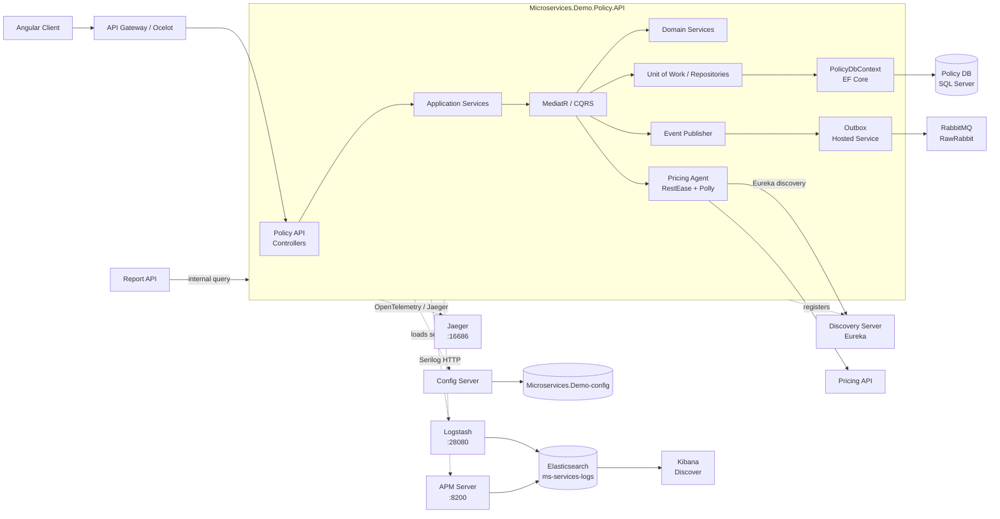
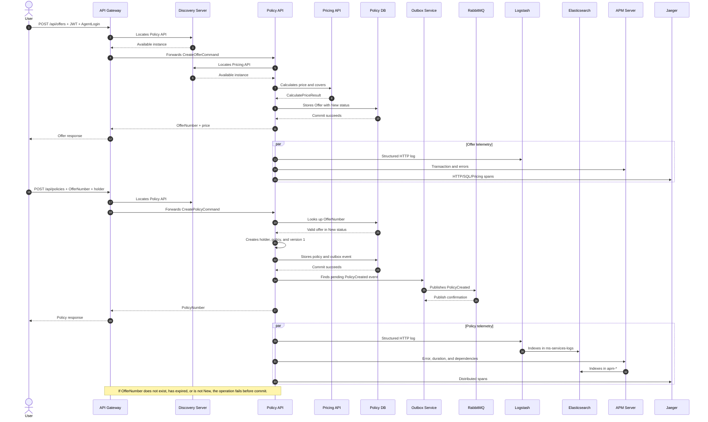

# Microservices.Demo.Policy.API

Microservice responsible for the insurance platform's offer and policy lifecycle. It receives requests from the API Gateway, validates and converts offers into policies, requests prices from Pricing API, persists its own model in SQL Server, and publishes business events through RabbitMQ.

Policy API owns its data. Other services, such as Report API, query its endpoints and do not access its database directly.

## Internal architecture

```text
HTTP/Gateway
    |
    v
Controllers -> Application -> MediatR/CQRS -> Domain
                                      |             |
                                      v             v
                              Policy DB/EF Core   Pricing API
                                      |
                                      v
                                Outbox -> RabbitMQ
```

The entry point is `Program.cs`. Code is separated into:

- `Controllers`: HTTP endpoints for offers and policies.
- `Application`: coordinates operations and sends commands/queries through MediatR.
- `CQRS`: creation, lookup, and termination handlers.
- `Domain`: business rules for offers, policies, holders, and prices.
- `Infrastructure/Data`: `PolicyDbContext`, repositories, and Unit of Work.
- `Infrastructure/Agents/Pricing`: HTTP client that locates Pricing API through Eureka.
- `Infrastructure/Messaging`: RawRabbit, outbox, and event publishing.
- `Infrastructure/Jaeger`: distributed trace instrumentation.

Main technologies are ASP.NET Core/.NET 6, EF Core, SQL Server, MediatR, RawRabbit, RestEase, Polly, Steeltoe Config Server/Eureka, Serilog, Elastic APM, OpenTelemetry, and Jaeger.

## Component diagram



### Component responsibilities

- **Gateway**: receives public requests, validates JWTs, applies Ocelot routes, and adds `AgentLogin` when required.
- **Controllers/Application/MediatR**: convert HTTP requests into commands and queries and select the handler.
- **Domain**: applies rules such as offer validity, `New` status, offer conversion, and policy creation.
- **Data**: owns the transaction and Policy API's exclusive access to SQL Server.
- **Pricing Agent**: locates Pricing API through Eureka and retries failed HTTP calls three times.
- **Outbox**: separates the business transaction from event publication; the hosted service sends pending messages to RabbitMQ.
- **Observability**: logs go to Logstash/Elasticsearch, APM receives telemetry, and Jaeger receives distributed spans.

## Sequence diagram

The following flow shows the two main operations. Offer creation calls Pricing API; offer conversion persists the policy and publishes `PolicyCreated` through the outbox.



## Endpoints and business flow

- `POST /api/offers`: calculates and creates an offer. Receives `ProductCode`, dates, covers, and answers; also uses the `AgentLogin` header.
- `POST /api/policies`: converts an existing offer into a policy. Receives `OfferNumber`, `PolicyHolder`, and `PolicyHolderAddress`.
- `GET /api/policies`: lists stored policies.
- `GET /api/policies/{policyNumber}`: gets policy details.
- `DELETE /terminate`: terminates a policy. The absolute route is `/terminate`, not `/api/policies/terminate`.

### Create an offer

1. The Gateway authenticates the JWT and builds `AgentLogin` from claims.
2. Policy API receives `POST /api/offers`.
3. It calls Pricing API to calculate cover prices.
4. Pricing is located through Eureka; the client retries up to three times with a three-second delay after `HttpRequestException`.
5. Policy API stores the offer in SQL Server and returns `OfferNumber`.

### Convert an offer into a policy

1. The client sends the `OfferNumber` returned by the offer operation.
2. Policy API finds the offer and checks that it exists, has not expired, and is in `New` status.
3. It creates the holder, policy, and first version.
4. It stores the policy in SQL Server.
5. It publishes `PolicyCreated` through the outbox and RabbitMQ.

If `OfferNumber` does not exist, has expired, or has already been converted, the operation cannot complete. Investigate Policy API and Policy DB logs.

Protected operations require a JWT. Offers uses the `AgentLogin` header built by the Gateway from token claims.

## Dependencies and configuration

- **SQL Server**: `microservices.demo.policy.db`; host port `14332`, internal port `1433`. Configured through `ConnectionStrings:PolicyConnection`.
- **Pricing API**: located through Eureka and configured with `ServicesUrl:PricingApiUrl`.
- **RabbitMQ**: host `microservices.demo.rabbitmq`; internal AMQP port `5672`, management port `15672`. Options are under `RabbitMQSettings`.
- **Config Server**: provides connection strings, Pricing URL, Eureka, RabbitMQ, and observability settings. With `failFast=true`, configuration errors can prevent startup.
- **Discovery Server**: Eureka registers Policy API and locates Pricing API.
- **Logstash**: receives structured logs over HTTP at `microservices.demo.logstash:28080`.
- **Elasticsearch**: stores logs in `ms-services-logs`.
- **APM Server**: receives Elastic APM transactions, errors, and metrics.
- **Jaeger**: receives OpenTelemetry/Jaeger spans for distributed traces.

The service registers as `Microservices.Demo.Policy.API`.

Policy API uses the Docker `backend` network. Inside Docker use service names, not `localhost`; from the host use published ports.

## Docker

```powershell
docker-compose -f ..\..\..\docker-compose-all.yml build microservices.demo.policy.api
docker-compose -f ..\..\..\docker-compose-all.yml up -d microservices.demo.policy.api
```

For a complete startup from the repository root:

```powershell
docker-compose -f .\docker-compose-infr.yml up -d
docker-compose -f .\docker-compose-db.yml up -d
docker-compose -f .\docker-compose-app.yml up -d microservices.demo.policy.api
```

Check replicas and dynamic ports with:

```powershell
docker-compose -f .\docker-compose-app.yml ps microservices.demo.policy.api
```

## Local execution

Requires the .NET 6 SDK. Start Policy DB, RabbitMQ, Pricing API, Config Server, and Eureka first, then run from this directory:

```powershell
dotnet restore
dotnet run
```

Policy needs RabbitMQ to publish messages and Pricing API to calculate prices. The web application should continue calling the Gateway, not the API's internal port.

## Observability

Policy API exposes three observability signals:

| Signal | Route                                                                        | What to inspect                                                   |
| ------ | ---------------------------------------------------------------------------- | ----------------------------------------------------------------- |
| Logs   | Policy API -> Logstash `28080` -> Elasticsearch `ms-services-logs` -> Kibana | Exceptions, endpoint, HTTP method, duration, and domain messages. |
| APM    | Policy API -> APM Server `8200` -> `apm-*` indexes                           | Slow transactions, errors, and SQL/Pricing/RabbitMQ calls.        |
| Traces | Policy API -> Jaeger `16686`                                                 | Request path and its dependencies.                                |

To view logs in Kibana, use the `Microservices logs` Data View with the exact `ms-services-logs` pattern and `@timestamp` time field. Do not use a Data View that mixes `apm-*` with `ms-services-logs`.

## Error diagnosis

Start by identifying the replica that received the request:

```powershell
docker ps --filter name=policy.api
docker logs --since 10m microservicesdemo-microservices.demo.policy.api-1
docker logs --since 10m microservicesdemo-microservices.demo.policy.api-2
```

Filter errors related to the operation:

```powershell
docker logs --since 30m microservicesdemo-microservices.demo.policy.api-1 2>&1 |
    Select-String "error|exception|policy|offer|pricing|rabbit|sql" -CaseSensitive:$false
```

Review dependencies in this order:

1. **Gateway**: confirm the route, JWT, and status received from the API.
2. **Policy API**: find the complete exception and specific replica.
3. **Policy DB**: check connection, schema, offer data, and SQL constraints.
4. **Pricing API**: required by `POST /api/offers`; check Eureka and its logs.
5. **RabbitMQ**: required to publish events after creating or terminating a policy.
6. **Logstash/Elasticsearch**: affects log visibility only and should not by itself stop business operations.

Useful commands:

```powershell
docker logs --tail 200 Microservices.Demo.Client.Web.ApiGateway
docker logs --tail 200 Microservices.Demo.Policy.db
docker logs --tail 200 microservicesdemo-microservices.demo.pricing.api-1
docker logs --tail 200 Microservices.Demo.Rabbitmq
curl.exe http://localhost:9200/ms-services-logs/_count
curl.exe http://localhost:16686
```

For a `500` on `GET /api/policies`, SQL Server/Policy DB is the first suspect. For a `500` on `POST /api/offers`, check Pricing API, Eureka, and response format. For a `500` on `POST /api/policies`, first validate that `OfferNumber` exists and the offer is in `New` status; then check SQL Server, the outbox, and RabbitMQ.

## Main payloads

Create an offer:

```json
{
  "ProductCode": "PRODUCT-CODE",
  "PolicyFrom": "2026-09-21T00:00:00Z",
  "PolicyTo": "2027-09-20T00:00:00Z",
  "SelectedCovers": ["COVER-1"],
  "Answers": []
}
```

Create a policy:

```json
{
  "OfferNumber": "offer-number-returned-by-api",
  "PolicyHolder": {
    "FirstName": "Erick",
    "LastName": "Acero",
    "TaxId": "123456789"
  },
  "PolicyHolderAddress": {
    "Country": "Poland",
    "ZipCode": "00-001",
    "City": "Warsaw",
    "Street": "Main Street 1"
  }
}
```
