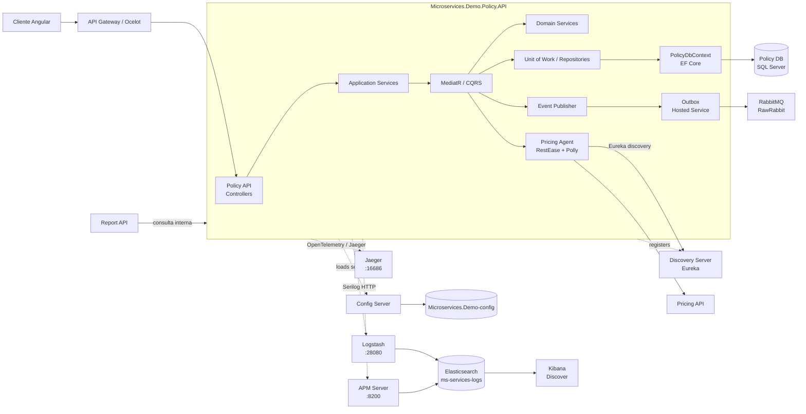
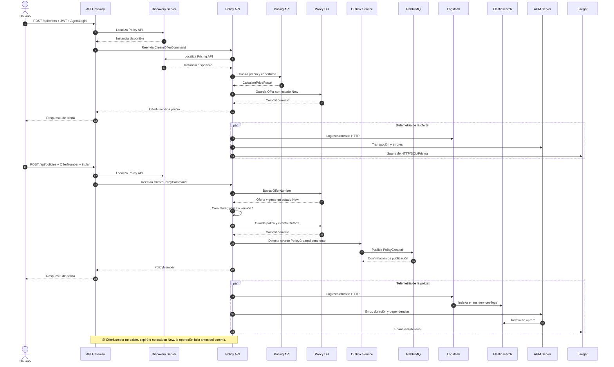

# Microservices.Demo.Policy.API

Microservicio responsable del ciclo de vida de ofertas y pólizas de la plataforma de seguros. Recibe solicitudes del API Gateway, valida y transforma ofertas en pólizas, consulta precios mediante Pricing API, persiste su propio modelo en SQL Server y publica eventos de negocio mediante RabbitMQ.

Policy API es dueño de sus datos. Otros servicios, como Report API, consultan la información a través de sus endpoints y no acceden directamente a su base de datos.

## Arquitectura interna

```text
HTTP/Gateway
	|
	v
Controllers -> Application -> MediatR/CQRS -> Domain
									  |             |
									  v             v
							  Policy DB/EF Core   Pricing API
									  |
									  v
								Outbox -> RabbitMQ
```

La entrada es `Program.cs`. El código está separado en:

- `Controllers`: endpoints HTTP para ofertas y pólizas.
- `Application`: coordina las operaciones y envía comandos/queries a MediatR.
- `CQRS`: handlers de creación, consulta y terminación.
- `Domain`: reglas de negocio de ofertas, pólizas, titulares y precios.
- `Infrastructure/Data`: `PolicyDbContext`, repositorios y Unit of Work.
- `Infrastructure/Agents/Pricing`: cliente HTTP que localiza Pricing API mediante Eureka.
- `Infrastructure/Messaging`: RawRabbit, outbox y publicación de eventos.
- `Infrastructure/Jaeger`: instrumentación de trazas distribuidas.

La tecnología principal es ASP.NET Core/.NET 6, EF Core, SQL Server, MediatR, RawRabbit, RestEase, Polly, Steeltoe Config Server/Eureka, Serilog, Elastic APM, OpenTelemetry y Jaeger.

## Diagrama de componentes



### Responsabilidad de cada componente

- **Gateway**: recibe la petición pública, valida JWT, aplica rutas Ocelot y añade `AgentLogin` cuando corresponde.
- **Controllers/Application/MediatR**: convierten HTTP en comandos y queries, y seleccionan el handler de la operación.
- **Domain**: aplica reglas como oferta vigente, estado `New`, conversión de oferta y creación de la póliza.
- **Data**: mantiene la transacción y el acceso exclusivo de Policy API a SQL Server.
- **Pricing Agent**: localiza Pricing API mediante Eureka y reintenta tres veces las llamadas HTTP fallidas.
- **Outbox**: desacopla la transacción de negocio de la publicación de eventos; el servicio hospedado envía mensajes pendientes a RabbitMQ.
- **Observabilidad**: los logs van a Logstash/Elasticsearch, APM recibe telemetría y Jaeger recibe spans distribuidos.

## Diagrama de secuencia

El flujo siguiente muestra las dos operaciones principales. La creación de una oferta llama a Pricing API; la conversión de una oferta persiste la póliza y publica `PolicyCreated` mediante el outbox.



## Endpoints y flujo de negocio

- `POST /api/offers`: calcula y crea una oferta. Recibe `ProductCode`, fechas, coberturas y respuestas; también usa el header `AgentLogin`.
- `POST /api/policies`: convierte una oferta existente en póliza. Recibe `OfferNumber`, `PolicyHolder` y `PolicyHolderAddress`.
- `GET /api/policies`: lista las pólizas almacenadas.
- `GET /api/policies/{policyNumber}`: obtiene el detalle de una póliza.
- `DELETE /terminate`: termina una póliza. La ruta absoluta es `/terminate`, no `/api/policies/terminate`.

### Crear una oferta

1. Gateway autentica el JWT y construye `AgentLogin` desde las claims.
2. Policy API recibe `POST /api/offers`.
3. Consulta Pricing API para calcular el precio de las coberturas.
4. Pricing se localiza con Eureka; el cliente aplica hasta tres reintentos con una espera de tres segundos ante `HttpRequestException`.
5. Policy API guarda la oferta en SQL Server y devuelve `OfferNumber`.

### Convertir una oferta en póliza

1. El cliente envía el `OfferNumber` devuelto por la oferta.
2. Policy API busca la oferta y comprueba que exista, no haya expirado y esté en estado `New`.
3. Crea el titular, la póliza y su primera versión.
4. Guarda la póliza en SQL Server.
5. Publica `PolicyCreated` mediante el outbox y RabbitMQ.

Si el `OfferNumber` no existe, está vencido o ya fue convertido, la operación no puede completarse y debe investigarse el error en los logs de Policy API y en Policy DB.

Las operaciones protegidas requieren JWT. Offers usa el header `AgentLogin`, que el Gateway construye desde las claims del token.

## Dependencias y configuración

- **SQL Server**: `microservices.demo.policy.db`; puerto host `14332`, puerto interno `1433`. Se configura mediante `ConnectionStrings:PolicyConnection`.
- **Pricing API**: se localiza mediante Eureka y se configura con `ServicesUrl:PricingApiUrl`.
- **RabbitMQ**: host `microservices.demo.rabbitmq`; AMQP interno `5672`, management `15672`. Sus opciones están bajo `RabbitMQSettings`.
- **Config Server**: entrega connection strings, URL de Pricing, Eureka, RabbitMQ y opciones de observabilidad. Con `failFast=true`, un fallo de configuración puede impedir el arranque.
- **Discovery Server**: Eureka registra Policy API y permite localizar Pricing API.
- **Logstash**: recibe logs estructurados por HTTP en `microservices.demo.logstash:28080`.
- **Elasticsearch**: almacena los logs en `ms-services-logs`.
- **APM Server**: recibe transacciones, errores y métricas de Elastic APM.
- **Jaeger**: recibe spans de OpenTelemetry/Jaeger para trazas distribuidas.

El servicio se registra como `Microservices.Demo.Policy.API`.

Policy API usa la red Docker `backend`. Dentro de Docker deben usarse nombres de servicio, no `localhost`; desde el host solo se usan los puertos publicados.

## Docker

```powershell
docker-compose -f ..\..\..\docker-compose-all.yml build microservices.demo.policy.api
docker-compose -f ..\..\..\docker-compose-all.yml up -d microservices.demo.policy.api
```

Para un arranque completo, en la raíz del repositorio:

```powershell
docker-compose -f .\docker-compose-infr.yml up -d
docker-compose -f .\docker-compose-db.yml up -d
docker-compose -f .\docker-compose-app.yml up -d microservices.demo.policy.api
```

Comprueba las réplicas y sus puertos dinámicos con:

```powershell
docker-compose -f .\docker-compose-app.yml ps microservices.demo.policy.api
```

## Ejecución local

Requiere el SDK de .NET 6. Arranca Policy DB, RabbitMQ, Pricing API, Config Server y Eureka; después ejecuta desde esta carpeta:

```powershell
dotnet restore
dotnet run
```

Policy necesita RabbitMQ para publicar mensajes y Pricing API para calcular precios. La aplicación web debe seguir llamando al Gateway, no al puerto interno del API.

## Observabilidad

Policy API expone tres señales de observabilidad:

| Señal  | Ruta                                                                         | Qué permite revisar                                                 |
| ------ | ---------------------------------------------------------------------------- | ------------------------------------------------------------------- |
| Logs   | Policy API -> Logstash `28080` -> Elasticsearch `ms-services-logs` -> Kibana | Excepciones, endpoint, método HTTP, duración y mensajes de dominio. |
| APM    | Policy API -> APM Server `8200` -> índices `apm-*`                           | Transacciones lentas, errores y llamadas a SQL/Pricing/RabbitMQ.    |
| Trazas | Policy API -> Jaeger `16686`                                                 | Recorrido de una petición y sus dependencias.                       |

Para ver los logs en Kibana, usa la Data View `Microservices logs`, con el patrón exacto `ms-services-logs` y el campo temporal `@timestamp`. No uses una Data View que mezcle `apm-*` con `ms-services-logs`.

## Diagnóstico de errores

Empieza por identificar la réplica que recibió la petición:

```powershell
docker ps --filter name=policy.api
docker logs --since 10m microservicesdemo-microservices.demo.policy.api-1
docker logs --since 10m microservicesdemo-microservices.demo.policy.api-2
```

Filtra errores relacionados con la operación:

```powershell
docker logs --since 30m microservicesdemo-microservices.demo.policy.api-1 2>&1 |
	Select-String "error|exception|policy|offer|pricing|rabbit|sql" -CaseSensitive:$false
```

Revisa las dependencias en este orden:

1. **Gateway**: confirma la ruta, el JWT y el status que recibe del API.
2. **Policy API**: busca la excepción completa y la réplica concreta.
3. **Policy DB**: comprueba conexión, esquema, datos de la oferta y restricciones SQL.
4. **Pricing API**: necesario para `POST /api/offers`; revisa Eureka y sus logs.
5. **RabbitMQ**: necesario para publicar eventos después de crear o terminar una póliza.
6. **Logstash/Elasticsearch**: solo afecta la visibilidad de logs, no debería impedir por sí mismo la operación de negocio.

Comandos útiles:

```powershell
docker logs --tail 200 Microservices.Demo.Client.Web.ApiGateway
docker logs --tail 200 Microservices.Demo.Policy.db
docker logs --tail 200 microservicesdemo-microservices.demo.pricing.api-1
docker logs --tail 200 Microservices.Demo.Rabbitmq
curl.exe http://localhost:9200/ms-services-logs/_count
curl.exe http://localhost:16686
```

Para un `500` en `GET /api/policies`, el primer sospechoso es SQL Server/Policy DB. Para un `500` en `POST /api/offers`, revisa Pricing API, Eureka y el formato de respuestas. Para un `500` en `POST /api/policies`, valida primero que `OfferNumber` exista y que la oferta esté en estado `New`; después revisa SQL Server, el outbox y RabbitMQ.

## Payloads principales

Crear oferta:

```json
{
  "ProductCode": "PRODUCT-CODE",
  "PolicyFrom": "2026-09-21T00:00:00Z",
  "PolicyTo": "2027-09-20T00:00:00Z",
  "SelectedCovers": ["COVER-1"],
  "Answers": []
}
```

Crear póliza:

```json
{
  "OfferNumber": "offer-number-returned-by-api",
  "PolicyHolder": {
    "FirstName": "Erick",
    "LastName": "Acero",
    "TaxId": "123456789"
  },
  "PolicyHolderAddress": {
    "Country": "Poland",
    "ZipCode": "00-001",
    "City": "Warsaw",
    "Street": "Main Street 1"
  }
}
```
